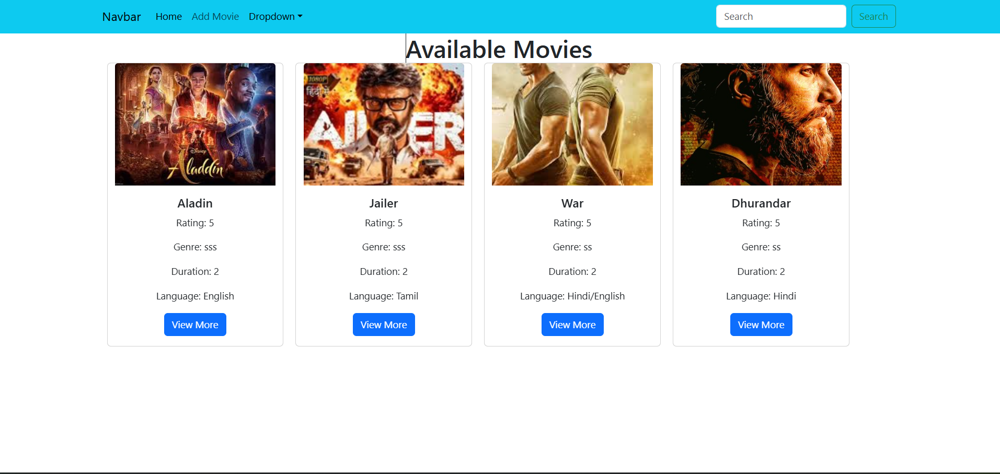
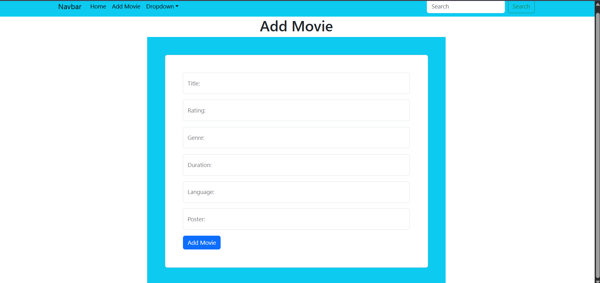
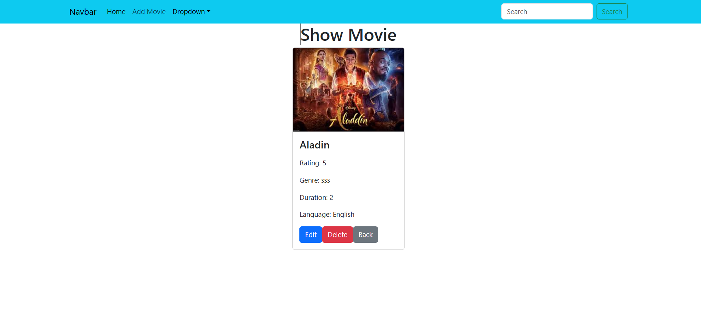
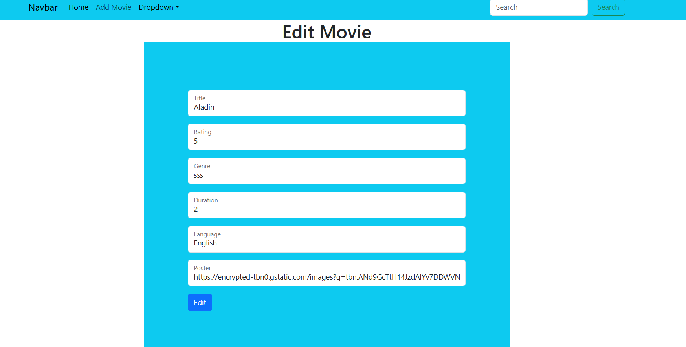

# 🎬 Movie Management App (MERN Stack)

A full-stack Movie Management Application built using the MERN stack (MongoDB, Express, React, Node.js). This app allows users to add, view, edit, and manage movie details.

---

## 🚀 Features

- ➕ Add new movies
- 📃 View all movies
- 🔍 View single movie details
- ✏️ Edit movie information
- 🗑️ Delete movies (if implemented)
- 📦 REST API integration
- 🎨 Responsive UI using Bootstrap

---

## 🛠️ Tech Stack

### Frontend
- React.js
- React Router DOM
- Axios
- Bootstrap

### Backend
- Node.js
- Express.js

### Database
- MongoDB
- Mongoose

---

## 📁 Project Structure
## 📸 Screenshots

### 🏠 Home Page

### ➕ Add Movie

### 🎬 Movie Details

### ✏️ Edit Movie
